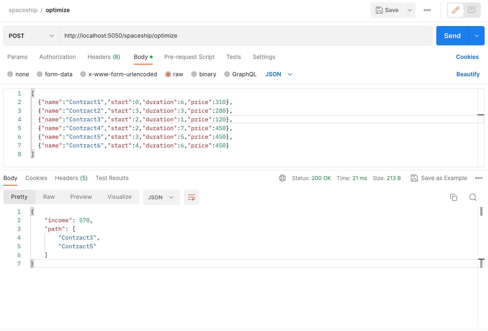

# Spaceship Rental Model

This repository contains a flask API which takes in a list of contracts.

Each contract has a start time, an end time, and a profit.

We only have one spaceship to rent.

This is a practice on a knapsack problem, where we want to maximize the profits we get by choosing the most optimal contracts.

## Creating a virtual environment

Create a virtual environment with python3.9

```commandline
virtualenv venv -p $(which python3.9)
```

## Activate the virtual environment

```commandline
source venv/bin/activate
```

## Installing requirements into virtual environment

```commandline
pip3 install -r requirements.txt
```

## Spinning up the API service locally

Spin up the local server on port 5050

```
export PYTHONPATH=. && python3 main.py
```

## Sample request

POST http://localhost:5050/spaceship/optimize

Payload

```json
[
  {"name":"Contract1","start":0,"duration":6,"price":310},
  {"name":"Contract2","start":3,"duration":3,"price":280},
  {"name":"Contract3","start":2,"duration":1,"price":120},
  {"name":"Contract4","start":2,"duration":7,"price":450},
  {"name":"Contract5","start":3,"duration":5,"price":450},
  {"name":"Contract6","start":4,"duration":6,"price":450}
]
```

Expected Output:

```json
{
    "income": 570,
    "path": [
        "Contract3",
        "Contract5"
    ]
}
```


